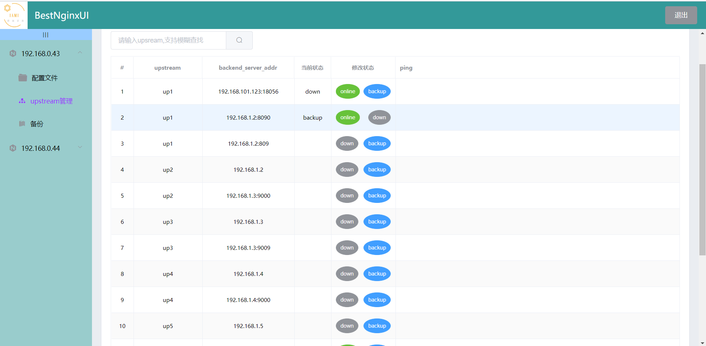

# BestNginxUI

## 项目简介

我认为这是一个更加贴合运维人员思维和操作习惯的 nginx 配置文件 web 管理平台。

- 使用简单
- 与 nginx 解耦，随时可插拔
- 采用 C/S 架构，客户端启动，就会把配置文件推到服务端，服务端自动完成初始化，无需手动初始化
- 以文件为颗粒度进行配置文件的修改
- 对 upstream 的管理非常方便，一键操作 upstream 中 server 的状态
- 可以同时管理多个 nginx

## 环境依赖

- 安装 python3.6+
  ```shell
  yum -y install python3
  yum -y install python3-devel
  ```
- 安装数据库：sqlite3
  ```shell
  yum -y install sqlite-3.7.17-8.el7_7.1.x86_64
  ```

## 部署步骤

此项目后端用 fastapi 开发，前端用 vue2.6.12 开发。先部署 server 端，再部署 client 端。

### 1、server 端部署

- cd 到 server 目录下，运行以下命令

  ```shell
  pip3 install  -r  requirements.txt
  ```

- 修改 conf/conf_server.ini 配置文件

  修改 ip，端口不冲突则无需修改。

  ```ini
  [uvicorn]
  ;vicorn服务端启ip和端口
  ip = 192.168.0.45
  port = 18000

  [client]
  ;此处无需配置，客户端启动后会发送其ip、port到服务端，然后保存到这里。
  ```

- 启动服务：

  ```shell
  python3 server.py &
  ```

- 访问 http://192.168.0.45:18000，

- 用户名：admin，密码：admin，至此服务端部署完成

  

  

  此时没有任何数据，等客户端启动成功后，就会看到数据。

### 2、client 端部署

- client 端，部署在需要被管理的 nginx 上。

- cd 到 client 目录下，运行以下命令

  ```shell
  pip3 install -r  requirements.txt
  ```

- 修改配置文件:

  ```ini
  [server]
  ;服务端的ip和端口
  ip=192.168.0.45
  port=18000

  [nginx]
  ;本机nginx的ip
  nginx_ip=192.168.0.43

  ;nginx主配置文件绝对路径
  nginx_main_conf_path=/etc/nginx/nginx.conf

  [uvicorn]
  ;uvicorn服务启动参数
  ip=0.0.0.0
  port=18000
  ```

- 启动服务：

  ```shell
  python3 clinet.py &
  ```

- 客户端启动后会把配置推送到服务端，刷新页面即可看到 nginx 的所有配置文件

- 配置文件管理页如下：

  

- upsream 管理也如下：
  
